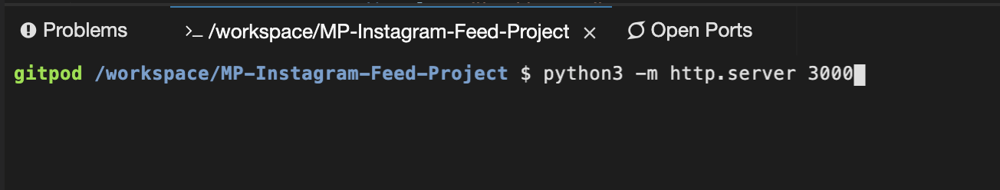
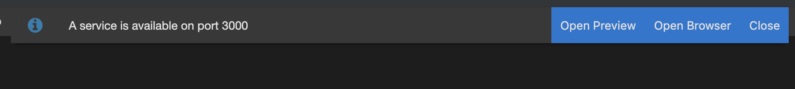

# MP-Instagram-Feed-Project

  The aim of this project was to replicate the layout of an Instagram Post, using only HTML and CSS. 

## Instructions To Open Project Live

  This project was originally developed on and run through GitPod. If you'd like to view the page live in a browser, run "python3 -m http.server 3000" in the command terminal. Once entered, Gitpod will give you options to view the project; click "Open Browser". A new tab should open up displaying the page. 

